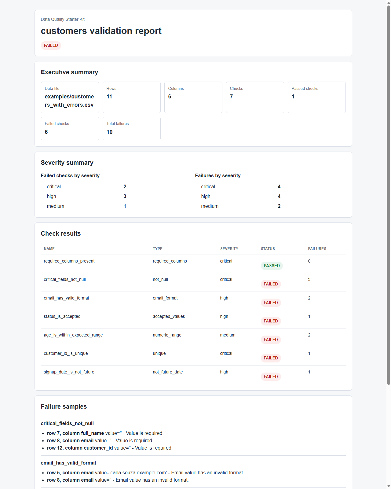

# Data Quality Starter Kit

## Versão Em Português

### Problema De Negócio

Times pequenos frequentemente tomam decisões a partir de arquivos CSV, planilhas, extrações de ERP, relatórios de CRM e cargas manuais sem saber se esses dados estão completos, consistentes ou confiáveis. Um ID de cliente ausente, uma fatura duplicada, um status inválido ou uma exportação desatualizada pode quebrar relatórios silenciosamente e levar a decisões operacionais ruins.

Este projeto parte de uma pergunta prática:

> Uma empresa consegue verificar rapidamente se um arquivo CSV é confiável o suficiente para ser usado?

### Proposta De Valor

O Data Quality Starter Kit é um kit leve em Python para validar arquivos CSV com regras configuráveis e gerar um relatório simples, compreensível tanto para usuários técnicos quanto para usuários de negócio.

O valor pretendido é transformar qualidade de dados de uma checagem manual informal em um processo repetível:

- definir regras de validação em um arquivo de configuração;
- executar validações contra dados CSV;
- resumir falhas com clareza;
- gerar um relatório simples;
- reutilizar a mesma estrutura em portfólio, auditorias para clientes e pequenos fluxos com cara de produção.

### Escopo Do MVP

O primeiro MVP foca em um fluxo estreito, mas útil:

- ler um ou mais arquivos CSV;
- carregar regras de validação a partir de um arquivo de configuração;
- suportar checagens básicas como colunas obrigatórias, campos não nulos, chaves únicas, valores aceitos, intervalos numéricos, formato de email e data futura;
- retornar resultados estruturados de validação;
- gerar um relatório HTML simples;
- incluir dados de exemplo realistas;
- incluir testes automatizados básicos;
- documentar instalação, uso, premissas e valor de negócio.

Fora do escopo do primeiro MVP:

- conexões com bancos de dados;
- armazenamento em nuvem;
- orquestração;
- dashboards;
- serviços pagos;
- perfilamento complexo de dados;
- observabilidade corporativa completa.

### Setup Local

Requisitos:

- Python 3.11 ou superior;
- nenhuma dependência externa instalada.

No PowerShell, a partir da raiz do projeto:

```powershell
$env:PYTHONPATH = "src"
```

Depois disso, os comandos abaixo podem ser executados sem instalar o pacote.

### Arquitetura

O fluxo do MVP e propositalmente simples:

```text
configs/customers.json
        |
        v
examples/customers_*.csv -> read_csv -> validate_dataset -> ValidationReport
                                                    |
                                                    +-> terminal text
                                                    +-> JSON serializavel
                                                    +-> HTML report
```

Principais modulos:

- `config.py`: carrega e valida o arquivo JSON de regras.
- `csv_file.py`: le arquivos CSV em memoria para o MVP local.
- `validator.py`: aplica as regras de qualidade configuradas.
- `result.py`: estrutura o contrato de resultado e serializacao.
- `html_report.py`: gera um relatorio HTML estatico.
- `cli.py`: expoe o comando `validate`.

### Execução Atual

A base técnica atual permite carregar um arquivo de configuração JSON, ler um CSV e executar as primeiras regras de qualidade configuráveis.

Quando o pacote estiver disponível no Python path, a CLI pode ser chamada assim:

```bash
python -m data_quality_starter validate --data examples/customers_valid.csv --config configs/customers.json
```

Para gerar um relatório HTML simples em uma pasta de saída:

```bash
python -m data_quality_starter validate --data examples/customers_with_errors.csv --config configs/customers.json --report-dir reports
```

Para reproduzir a demo com data fixa:

```bash
python -m data_quality_starter validate --data examples/customers_with_errors.csv --config configs/customers.json --report-dir docs/demo-output --today 2026-06-07
```

Para gerar saída JSON serializável:

```bash
python -m data_quality_starter validate --data examples/customers_with_errors.csv --config configs/customers.json --format json --today 2026-06-07
```

Para rodar os testes automatizados:

```bash
python -B -m unittest discover -s tests -v
```

Saída atual:

- resumo do dataset carregado;
- quantidade de linhas e colunas do CSV;
- status geral da validação;
- resultado por regra;
- amostras de falhas por linha e coluna;
- resumo estruturado com contagens por severidade;
- opção `--format json` para saída serializável;
- opção `--report-dir` para gerar `validation_report.html`;
- opção `--today` para tornar checagens de data reproduzíveis;
- código de saída `0` quando o arquivo passa;
- código de saída `1` quando alguma regra falha;
- código de saída `2` para erro de entrada ou configuração.

### Limitações

Este MVP ainda não tenta resolver todos os cenários de qualidade de dados. Limitações atuais:

- leitura em memoria, adequada apenas para CSVs pequenos ou medios;
- sem conexoes com bancos de dados;
- sem armazenamento em nuvem;
- sem orquestracao;
- sem dashboards;
- sem perfilamento estatistico complexo;
- sem suporte a multiplos formatos alem de CSV;
- sem regra configuravel de contagem minima ou maxima de linhas;
- sem publicacao ou servicos externos configurados.

Próximos aprimoramentos possíveis:

- regra configuravel de contagem minima ou maxima de linhas;
- suporte a multiplos arquivos em uma unica execucao;
- conectores locais para bancos de dados;
- integracao futura com orquestracao e observabilidade.

Nenhuma dependência foi instalada ainda. Este repositório contém o esqueleto inicial do projeto, uma CLI mínima, carregamento de configuração, leitura de CSV, as primeiras checagens de validação, um contrato de resultados serializável, geração de relatório HTML simples, testes automatizados básicos e demo local de portfólio.

### Caso De Demonstração

O caso inicial valida um arquivo CSV de clientes antes que os dados sejam usados em relatórios, campanhas ou análises.

Arquivos de demonstração:

- `docs/demo-case.md`: cenário de negócio, riscos de dados ruins e valor da validação;
- `docs/portfolio-demo.md`: narrativa curta de portfólio, comandos e resultado observado;
- `docs/demo-output/validation_report.html`: relatório HTML de exemplo;
- `docs/demo-output/validation_report.png`: screenshot do relatório HTML;
- `examples/customers_valid.csv`: base de clientes válida;
- `examples/customers_with_errors.csv`: base de clientes com erros realistas;
- `configs/customers.json`: regras de validação planejadas em JSON simples.

Screenshot da demo:



### Licença

MIT. Veja `LICENSE`.

---

## English Version

### Business Problem

Small teams often make decisions from CSV exports, spreadsheets, ERP extracts, CRM reports, and manual data dumps without knowing if those files are complete, consistent, or trustworthy. A single missing customer ID, duplicated invoice, invalid status, or stale export can silently break reporting and lead to bad operational decisions.

This project starts from a practical question:

> Can a business quickly verify whether a CSV file is reliable enough to use?

### Value Proposition

Data Quality Starter Kit is a lightweight Python kit for validating CSV files with configurable rules and generating a simple report that business and technical users can understand.

The intended value is to turn data quality from an informal manual check into a repeatable process:

- define validation rules in a config file;
- run checks against CSV data;
- summarize failures clearly;
- generate a simple report;
- reuse the same structure in portfolio demos, client audits, and small production-like workflows.

### MVP Scope

The first MVP will focus on a narrow but useful workflow:

- read one or more CSV files;
- load validation rules from a configuration file;
- support basic checks such as required columns, not-null fields, unique keys, accepted values, numeric ranges, email format, and future dates;
- return structured validation results;
- generate a simple HTML report;
- include realistic example data;
- include basic automated tests;
- document setup, usage, assumptions, and business value.

Out of scope for the first MVP:

- database connections;
- cloud storage;
- orchestration;
- dashboards;
- paid services;
- complex data profiling;
- enterprise-grade observability.

### Local Setup

Requirements:

- Python 3.11 or higher;
- no external dependencies installed.

From the project root in PowerShell:

```powershell
$env:PYTHONPATH = "src"
```

After that, the commands below can run without installing the package.

### Architecture

The MVP flow is intentionally simple:

```text
configs/customers.json
        |
        v
examples/customers_*.csv -> read_csv -> validate_dataset -> ValidationReport
                                                    |
                                                    +-> terminal text
                                                    +-> serializable JSON
                                                    +-> HTML report
```

Main modules:

- `config.py`: loads and validates the JSON rules file.
- `csv_file.py`: reads CSV files into memory for the local MVP.
- `validator.py`: applies configured data quality rules.
- `result.py`: structures the result contract and serialization.
- `html_report.py`: generates a static HTML report.
- `cli.py`: exposes the `validate` command.

### Current Execution

The current technical foundation can load a JSON config file, read a CSV file, and run the first configurable quality checks.

When the package is available on the Python path, the CLI can be called with:

```bash
python -m data_quality_starter validate --data examples/customers_valid.csv --config configs/customers.json
```

To generate a simple HTML report in an output folder:

```bash
python -m data_quality_starter validate --data examples/customers_with_errors.csv --config configs/customers.json --report-dir reports
```

To reproduce the demo with a fixed date:

```bash
python -m data_quality_starter validate --data examples/customers_with_errors.csv --config configs/customers.json --report-dir docs/demo-output --today 2026-06-07
```

To generate serializable JSON output:

```bash
python -m data_quality_starter validate --data examples/customers_with_errors.csv --config configs/customers.json --format json --today 2026-06-07
```

To run the automated tests:

```bash
python -B -m unittest discover -s tests -v
```

Current output:

- loaded dataset summary;
- CSV row and column counts;
- overall validation status;
- result per configured rule;
- failure samples by row and column;
- structured summary with severity counts;
- `--format json` option for serializable output;
- `--report-dir` option to generate `validation_report.html`;
- `--today` option for reproducible date checks;
- exit code `0` when the file passes;
- exit code `1` when any rule fails;
- exit code `2` for input or configuration errors.

### Limitations

This MVP does not try to solve every data quality scenario. Current limitations:

- in-memory reading, suitable only for small or medium CSV files;
- no database connections;
- no cloud storage;
- no orchestration;
- no dashboards;
- no complex statistical profiling;
- no support for formats other than CSV;
- no configurable minimum or maximum row-count rule yet;
- no publication or external services configured.

Possible next improvements:

- configurable minimum or maximum row-count rule;
- support for multiple files in a single run;
- local database connectors;
- future orchestration and observability integration.

No dependencies are installed yet. This repository currently contains the initial project skeleton, a minimal CLI, config loading, CSV reading, the first validation checks, a serializable result contract, simple HTML report generation, basic automated tests, and a local portfolio demo.

### Demo Case

The initial demo case validates a customer CSV file before the data is used in reports, campaigns, or analysis.

Demo assets:

- `docs/demo-case.md`: business scenario, bad data risks, and validation value;
- `docs/portfolio-demo.md`: short portfolio narrative, commands, and observed result;
- `docs/demo-output/validation_report.html`: sample HTML report;
- `docs/demo-output/validation_report.png`: screenshot of the HTML report;
- `examples/customers_valid.csv`: valid customer dataset;
- `examples/customers_with_errors.csv`: customer dataset with realistic errors;
- `configs/customers.json`: planned validation rules in a simple JSON format.

Demo screenshot:


### License

MIT. See `LICENSE`.
